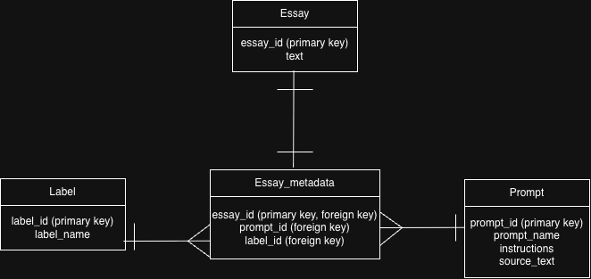

# DS 4320 Project 1: From Text to Integrity

### Executive Summary

This repository contains a Data by Design project 1, focused on early detection of whether textual news-style articles were  written by humans or generated by artificial intelligence (AI). The project utilizes a dataset from a Kaggle competition called "LLM - Detect AI Generated Text". This repository also includes necessary images, supporting documentation, metadata tables, a press release, MIT License, and pipeline jupyter notebooks that handle preprocessing and model training on the data. The project demonstrates the acquisition of the data, preprocessing, exploratory data analysis (EDA), and binary classification methods to predict if a text is AI-generated or completely human-authored. 

**Name**: Kayla Kim

**Computing ID**: rkf9wd

**DOI**: https://doi.org/10.5281/zenodo.19340926

  

**Press Release:** https://github.com/kayla-hekim/DS-4320-Project-1-From-Text-to-Integrity/blob/main/press_release.md

**Data**: https://github.com/kayla-hekim/DS-4320-Project-1-From-Text-to-Integrity/tree/main/data
1. csv_version: contains all data as csv files
2. parquet_version: contains all data converted into parquet format

Within OneDrive folder in same format of csv_version and parquet_version: https://onedrive.live.com/?id=%2Fpersonal%2F928157fc4e26bd54%2FDocuments%2FDocuments%2FDS4320%5Fproj1%5Frkf9wd&viewid=2523da70%2D0f0d%2D4ad4%2Da20b%2D4b150358a136&view=0

 

**Pipeline**: https://github.com/kayla-hekim/DS-4320-Project-1-From-Text-to-Integrity/tree/main/pipeline

**License**: MIT License, linked at https://github.com/kayla-hekim/DS-4320-Project-1-From-Text-to-Integrity/blob/main/LICENSE
- Dataset source: Kaggle - LLM Detect AI Generated Text
- Dataset license remains subject to Kaggle’s terms and original dataset author permissions.

  

## Problem Definition

**General Problem**: Detecting AI generated news-style article text

**Specific Problem**: Can word embeddings representations, like numerical vectors, and linguistic style features extracted from textual news articles and social media posts be used to accurately classify whether a piece of content was written entirely by a human or at least partly generated by an AI model?

**Rationale for Refinement**: By measuring word embeddings, numerical representations of words within a text, we can determine whether there is a measurable pattern or difference between human-generated and AI-generated content. The problem was then refined to focus on "entirely human-generated" versus "at least partly AI-generated" content, framing detection as a binary classification task rather than attempting to quantify a degree of AI involvement, which makes the problem more tractable and actionable.

**Motivation**: Public news articles and social media are among the fastest-spreading sources of misinformation in the digital age. AI-generated text content can be placed on these platforms within seconds, making it nearly impossible to verify authenticity in real time. This is why it's important to create a tool that anyone can use to determine if a text is entirely human-generated or at least partly AI-generated. By testing text content through measurable word embeddings, humans can identify patterns that signal potential AI involvement or irresponsible use of generative technology to spread misinformation.

**Headline:** [Can an Algorithm Tell If a News Article Was Written by a Human or AI? New Research Says Yes.](https://github.com/kayla-hekim/DS-4320-Project-1-From-Text-to-Integrity/blob/main/press_release.md)

  

## Domain Exposition

**Terminology**: 
| Term                              | Definition                                                                                                                                                                          |
|-----------------------------------|-------------------------------------------------------------------------------------------------------------------------------------------------------------------------------------|
| Word embedding                    | numerical representation, like in a vector of numerical features, of a word or piece of text that captures its meaning and context, often used as input for machine learning models |
| Linguistic style features         | measurable or quantifiable characteristics of writing such as sentence length, vocabulary diversity, punctuation patterns, tone, and more                                           |
| Binary classification             | machine learning task where the model predicts one out of two possible outcomes, such as deciding if text is human-generated versus AI-generated                                    |
| AI-generated text                 | text produced by an artificial intelligence language model such as GPT rather than written (entirely) by a human                                                                    |
| Large language model (LLM)        | type of AI model trained on massive amounts of text data and is capable of generating human-like writing                                                                            |
| Misinformation                    | false or inaccurate information spread regardless of intent to deceive                                                                                                              |
| Disinformation                    | type of misinformation, deliberately spread to deceive or manipulate others                                                                                                         |
| Natural language processing (NLP) | field of AI focused on enabling computers to understand and analyze human language or texts                                                                                         |
| Predictability                    | degree to which the next word in a text block can be anticipated, something that AI-generated texts tend to follow, enabling more predictable patterns than human writing           |
| Sentence length variation         | degree to which sentence lengths differ throughout a text, with human text writing tending to vary more than AI-generated text writing                                              |
| Training data                     | dataset used to teach a machine learning model to recognize patterns to then apply the model to new and unseen data                                                                 |
| Feature extraction                | the process of identifying and isolating measurable attributes from raw data, such as pulling numerical linguistic features from text                                               |
| Generative AI                     | a category of AI models capable of producing new content such as text, images, or audio                                                                                             |

 

**Project's Domain**: This project lives in the domain of media studies or journalism. Natural Language Processing (NLP) is a related domain in this project due to the "detection" nature of AI vs human generated texts. Key stakeholders include journalists and social media users who create and consume online content, academic researchers and students who rely on text content for research, and the general public with access to the generated texts. These stakeholders share a common concern for trust in consumed texts for the purpose of preventing misinformation spread and maintaining text authenticity and integrity. Data science or NLP fits in here by using numerical representation of linguistic characteristics found within texts and machine learning to automate detection at scale.

**Background Reading**: 
1. Arxiv - Detecting AI Generated Text Based on NLP and Machine Learning Approaches — paper proposing an AI detector model using XGB, SVM, and BERT to differentiate AI-generated from human-written text (src: https://arxiv.org/pdf/2404.10032)
2. Arxiv - Detecting AI-Generated Text: Factors Influencing Detectability - survey of NLP-based detection methods including watermarking, stylistic analysis, and pre-trained language models (src: https://arxiv.org/abs/2406.15583)
3. Nature - Identifying AI-generated content using DistilBERT and NLP techniques — study using transformer-based deep learning to classify human vs AI text (src: https://www.nature.com/articles/s41598-025-08208-7)
4. ACL Anthology - Detecting AI-Generated Text with Linguistic Features — paper using measurable linguistic and stylistic features to detect AI text (src: https://aclanthology.org/2024.icon-1.21.pdf)
5. Texas A&M thesis - Detecting AI Generated Text Using Neural Networks — graduate thesis reviewing the state of AI text detectors and adversarial challenges in NLP (src: https://digitalcommons.tamusa.edu/cgi/viewcontent.cgi?article=1000&context=masters_theses)

(Link to pdfs of all 5 readings: https://drive.google.com/drive/folders/1bvKl9Dp1E4vJj0vnZQMP1-kNebVNWT5x?usp=drive_link)

 

**Summary of Readings**: 
| Reading                                                                                                                   | Summary                                                                                                                                                                                                                                                         | Link in Folder |
|---------------------------------------------------------------------------------------------------------------------------|-----------------------------------------------------------------------------------------------------------------------------------------------------------------------------------------------------------------------------------------------------------------|----------------|
| "Detecting AI Generated Text Based on NLP and Machine Learning Approaches" (arxiv)                                   | Proposes an AI detector model that uses machine learning methods including XGB Classifier, SVM, and BERT to differentiate AI-generated text from human-written text. Finds that BERT outperforms other models in identifying AI-generated content    | [link](https://drive.google.com/file/d/1ozbXiGLN7p_2P63JGCHslc5EH7RykETe/view?usp=drive_link)           |
| "Detecting AI-Generated Text: Factors Influencing Detectability with Current Methods" (arxiv)                        | A survey of NLP-based detection methods for AI-generated text, covering three main approaches: watermarking, statistical and stylistic analysis, and pre-trained language model classifiers. Discusses the strengths and limitations of each approach | [link](https://drive.google.com/file/d/1q940Dj7F7Efo68eDVlAU397fL6_bUD0F/view?usp=drive_link)           |
| "Identifying artificial intelligence- generated content using the DistilBERT transformer and NLP techniques" (Nature) | Study using the DistilBERT transformer model and NLP techniques to classify human-written versus AI-generated text as a binary classification problem. Uses a dataset of 500,000  essays and explores deep linguistic features for detection          | [link](https://drive.google.com/file/d/1emo8heneCKwcNsWVxrp4ds7Czps-rabq/view?usp=drive_link)           |
| "Detecting AI-Generated Text with Pre-Trained Models using Linguistic Features" (Aclanthology)                       | Paper using measurable linguistic and stylistic features such as sentence length, readability scores, and vocabulary patterns to detect AI-generated text, comparing feature-based methods against pre-trained model approaches                       | [link](https://drive.google.com/file/d/1tjyGKoM9cV7bH9bUiYivxRSkggLIiyGp/view?usp=drive_link)           |
| "Detecting AI Generated Text Using Neural Networks" (Texas A&M)                                                           | Graduate thesis reviewing the current state of AI text detectors in NLP research, focusing on transformer-based architectures and adversarial challenges that make detection difficult across different domains                                        | [link](https://drive.google.com/file/d/13kE5tOxcuV7aH2N1yIX-fLiwczi9fdlh/view?usp=drive_link)           |

  

## Data Creation

**Raw Data Provenance**: I attained a CSV dataset called train_essays.csv from the Kaggle competition “LLM - Detect AI Generated Text.” After signing into my Kaggle account and joining the competition, I was able to access the data necessary for training. I then downloaded the dataset, which contains 1,378 text entries, and stored it in my local environment. Each entry consists of an essay along with a label indicating whether it was generated by an AI model or written by a human. The dataset was downloaded from Kaggle on March 2026 after joining the competition and stored locally before being transformed into CSV and parquet relational tables.

 

**Code Table**: 
| File Name                      | Description                                                                                                                                        | Code                                                                                   | Link |
|--------------------------------|----------------------------------------------------------------------------------------------------------------------------------------------------|----------------------------------------------------------------------------------------|------|
| train_essays.csv | Dataset from the Kaggle competition "LLM - Detect AI Generated Text"  containing essays labeled as AI-generated or human-written. | og = pd.read_csv("train_essays.csv")  # ensure train_essays.csv in same dir as code | [CSV Link](https://1drv.ms/x/c/928157fc4e26bd54/IQCGYdVQ6MxiTpEJ0nw2z2ekAbY2dYB4jvJq5CtdzbWmvik?e=taW2wO) |
| train_prompts.csv | Contains unique prompt information associated with each essay, including the prompt name, instructions given to the writer, and source  text used to guide the response. | prompts = pd.read_csv("train_prompts.csv")  # ensure train_prompts.csv in same dir as code | [CSV Link](https://1drv.ms/x/c/928157fc4e26bd54/IQDF8dz0SOXSTpcm_UJ0f-7HAZp8exzRS52Yuo2r1pyLyVc?e=r1ev8g) |

<!-- https://www.kaggle.com/competitions/llm-detect-ai-generated-text/data?select=train_essays.csv -->

 

**Bias Identification**: Bias could have been introduced through the extreme imbalance of the dataset, where only 3 out of 1,378 text samples (0.22%) were AI-generated while the remaining 1,375 were human-written. This can lead to increased false negative rates, where AI-generated text may be more often classified as human-generated due to the model being biased toward the majority class. There are also labels attached as either 1 (AI-generated) or 0 (non-AI-generated), and any errors or inconsistencies in these labels could introduce additional bias into the model if it is trained in a supervised manner.

**Bias Mitigation**: To mitigate the above bias with the imbalanced dataset and the attached labels, one could oversample the minority class in combination with modifying sample weighting to influence how the model learns from the dataset. One could also use bootstrapping techniques to evaluate whether the model is predicting accurately while still maintaining a high false negative rate. Additionally, using evaluation metrics such as precision, recall, and F1-score instead of accuracy can help better assess performance on imbalanced data.

**Rationale for Critical Decisions**: A key decision in this project was selecting the Kaggle dataset “LLM - Detect AI Generated Text,” as it directly aligns with the goal of distinguishing AI-generated text from human-written text. Another important decision was to use the provided labels (generated vs non-generated) for supervised learning, as this simplifies the classification task. However, this introduces uncertainty because the dataset is extremely imbalanced, with very few AI-generated samples compared to human-written ones, which may limit the model's ability to generalize. Additionally, uncertainty may arise from the quality and source of the labels, as AI-generated texts may come from specific models and may not represent all possible AI-generated writing styles. These uncertainties can be mitigated by balancing the dataset and carefully selecting evaluation metrics.

  

## Metadata

**Schema**: 

<!--   -->

**Data**: 

| Table Name     | Description                                             | Link |
|----------------|---------------------------------------------------------|------|
| Essay          | Contains essay text data with unique identifiers        | [CSV Link](https://1drv.ms/x/c/928157fc4e26bd54/IQBq11mr824_TJJfg9jQ-QZeAdm4lCZhan9xrxEZ52o3HDk?e=iM0yuh) |
| Label          | Contains label definitions for AI vs human text         | [CSV Link](https://1drv.ms/x/c/928157fc4e26bd54/IQCJuRdTmBkOSa2b_A4oXnXBAQcE4EDqA_H3VT-nr2jX4mo?e=Cl1rcb) |
| Prompt         | Contains prompt identifiers and descriptions for essays | [CSV Link](https://1drv.ms/x/c/928157fc4e26bd54/IQCJuRdTmBkOSa2b_A4oXnXBAQcE4EDqA_H3VT-nr2jX4mo?e=Cl1rcb) |
| Essay_metadata | Links essays to prompts and labels using foreign keys   | [CSV Link](https://1drv.ms/x/c/928157fc4e26bd54/IQB0OrxoJ1X-SLfN10Zfth2QAc4J2hWbN99cmRkYYy0T0KU?e=eKRp96) |

 

**Data Dictionary Table**: 

ESSAY:
| Name    | Data Type | Description                      | Example                                                                                                                                                                                                                               |
|----------|-----------|----------------------------------|---------------------------------------------------------------------------------------------------------------------------------------------------------------------------------------------------------------------------------------|
| essay_id | string    | Unique identifier for each essay | "0059830c"                                                                                                                                                                                                                              |
| text     | string    | Full essay text content          | "Cars. Cars have been around since they became famous in the 1900s, when Henry Ford created and built the first ModelTthat the cars have majorly polluted, .... To me, limiting the use of cars might be a good thing to do. |

PROMPT:

| Name         | Data Type | Description                                | Example                         |
|--------------|-----------|--------------------------------------------|---------------------------------|
| prompt_id  | integer   | Unique identifier for each prompt          | 0                               |
| prompt_name  | string    | Title of the prompt                        | "Car-free cities"               |
| instructions | string    | Instructions given to the writer of prompt | "Write an explanatory essay..." |
| source_text  | string    | Source material for the prompt             | "In German Suburb..."           |

LABEL:

| Name       | Data Type | Description                          | Example |
|------------|-----------|--------------------------------------|---------|
| label_id   | integer   | Identifier for label (0=Human, 1=AI) | 1       |
| label_name | string    | Label category name                  | "AI"    |

ESSAY_METADATA:

| Name      | Data Type | Description                      | Example  |
|-----------|-----------|----------------------------------|----------|
| essay_id  | string    | References essay in Essays table | "0059830c" |
| prompt_id | integer   | References prompt used for essay | 0        |
| label_id  | integer   | References label (AI or Human)   | 1        |

 

**Data Dictionary Uncertainty Quantification**: 

| Feature Name | Type                  | Uncertainty                                                                 |
|--------------|-----------------------|-----------------------------------------------------------------------------|
| prompt_id    | categorical (integer) | Low uncertainty, used as identifier, not a measured value                   |
| label_id     | categorical (integer) | Low uncertainty, but depends on correctness of labeling (values are 0 or 1) |

The numerical features in this dataset function as categorical identifiers (0 and 1 discrete) rather than measured values, so they have minimal inherent uncertainty. However, some uncertainty may arise in the `label_id` feature due to potential mislabeling of AI-generated versus human-written text as 1 or 0.