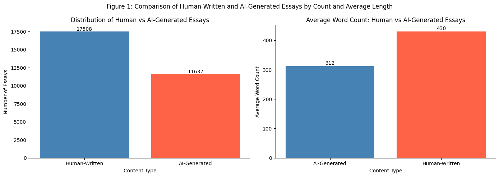

<!-- # <a name="press-release_project">Can an Algorithm Tell If a News Article Was Written by a Human or AI? New Research Says Yes.</a> -->
# Can an Algorithm Tell If a News Article Was Written by a Human or AI? New Research Says Yes.

## Hook:
Have you ever read an article from your local news and wondered if it was AI-generated? Word patterns hidden in the text may already hold the answer. 

## Problem Statement:
With the rise of AI in text generation for public content like journalism and social media, it has become increasingly difficult to distinguish authentic human writing from AI-assisted content, threatening the integrity of and public trust in media. Public news articles and social media are among the fastest-spreading sources of misinformation in the digital age. AI-generated text can be placed on these platforms within seconds, making it nearly impossible to verify authenticity in real time. Readers and consumers place trust in what they consume and understand, making this a severe problem as AI technologies continue improving at a rapid pace.
 

## Solution Description:
By testing text content through measurable word embeddings, numerical representations of words within a text, patterns can be identified that signal whether a piece of content is entirely human-generated or at least partly AI-generated. Human-generated texts tend to have a higher word count compared to that of AI-generated texts, as shown by the right plot below. The data has been pulled from the Kaggle dataset "LLM - Detect AI Generated Text Dataset" and displays the trend of AI vs human generated texts in the past couple of years. This numerical analysis creates a practical binary classification tool that journalists, editors, fact-checkers, and everyday consumers can use to flag potentially AI-generated writing before it has a chance to spread as misinformation.
 

<!-- chart -->
## Chart:
Figure 1: Comparison of Human-Written and AI-Generated Essays by Count and Average Length

